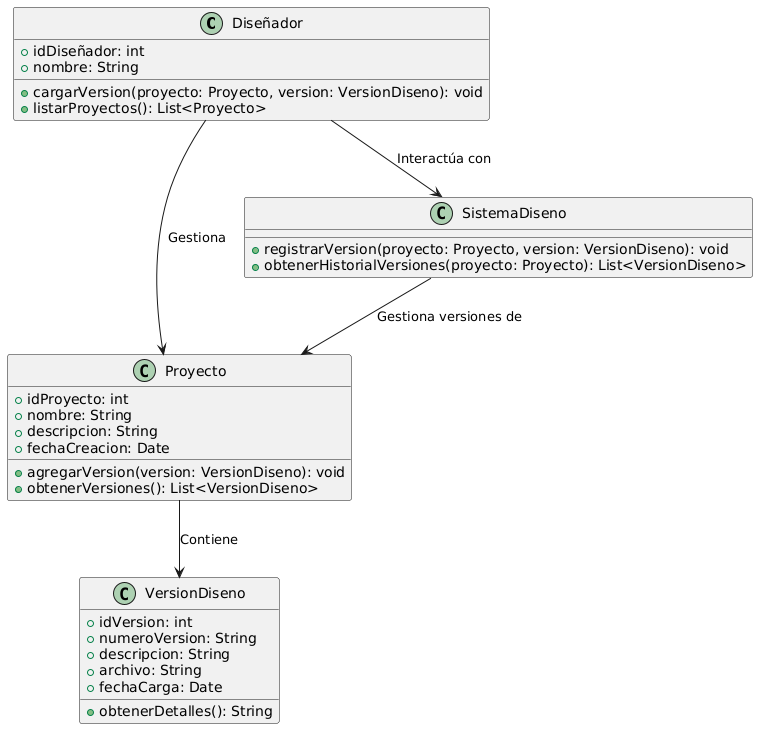

# GESTIÓN DE DISEÑO

------

## Caso de uso historia 
Laura, diseñadora, ha realizado ajustes en el diseño de un proyecto existente. Accede al sistema, selecciona el proyecto correspondiente y utiliza la opción "Cargar Nueva Versión". Sube el archivo con la actualización del diseño, agrega un comentario sobre los cambios realizados y guarda la nueva versión. El sistema organiza las versiones de forma cronológica, permitiendo un fácil seguimiento del historial de modificaciones.

---

  <tr class="idtext principal">
    <td>ID SYN-30</td>
  </tr>
  <tr class="single text">
    <td><strong>Requerimiento</strong>:Cargar versiones de diseño asociadas a un proyecto. ID SYN-30</td>
  </tr>
  <tr class="single gray">
    <td><strong>Historia de usuario</strong></td>
  </tr>
  <tr class="single text">
    <td>Como diseñador quiero cargar versiones de diseño asociadas a un proyecto para mantener un historial organizado de las modificaciones y actualizaciones realizadas al diseño.
</td>
  </tr>
  <tr class="duo">
    <th class="gray"><strong>Estado de la tarea</strong></th>
    <th>En desarrollo</th>
  </tr>
  <tr class="single gray">
    <td><strong>Caso de uso (Pasos)</strong></td>
  </tr>
  <tr class="single text">
    <td>
        <ol>
            <li>El diseñador accede al proyecto en el que desea cargar una versión de diseño.</li>
            <li>Selecciona la opción "Cargar Nueva Versión de Diseño".</li>
            <li>Adjunta el archivo correspondiente desde su dispositivo.</li>
            <li>Proporciona una descripción breve de la versión (por ejemplo, cambios realizados o motivo de la actualización).</li>
            <li>Confirma la carga de la versión.</li>
            <li>El sistema almacena el archivo, lo asocia al proyecto y actualiza el historial de versiones con la fecha y descripción ingresadas.</li>
          <li>El diseñador visualiza la nueva versión en el listado de versiones del proyecto.</li>
        </ol>
    </td>
  </tr>
  <tr class="single gray">
    <td><strong>Criterios de aceptación</strong></td>
  </tr>
  <tr class="single text">
    <td>
        <ol>
            <li>El sistema debe permitir cargar versiones de diseño únicamente si están asociadas a un proyecto existente.</li>
            <li>Los archivos cargados deben estar en formatos soportados y no superar el límite de tamaño permitido.</li>
            <li>El diseñador debe poder agregar una descripción breve durante la carga de la versión.</li>
            <li>Tras la carga exitosa, el sistema debe mostrar un mensaje de confirmación y reflejar la versión en el historial del proyecto.</li>
            <li>El diseñador debe poder visualizar y descargar las versiones previas asociadas al proyecto.</li>
            </ol>
 <tr class="duo">
    <th class="gray"><strong>Calidad</strong></th>
    <th>En desarrollo</th>
  </tr>
  <tr class="duo">
    <th class="gray"><strong>Versionamiento</strong></th>
    <th>En desarrollo</th>
  </tr>
</table>

---
## Diagrama de Caso de uso
[Creado con plantuml](https://plantuml.com/es/)

---