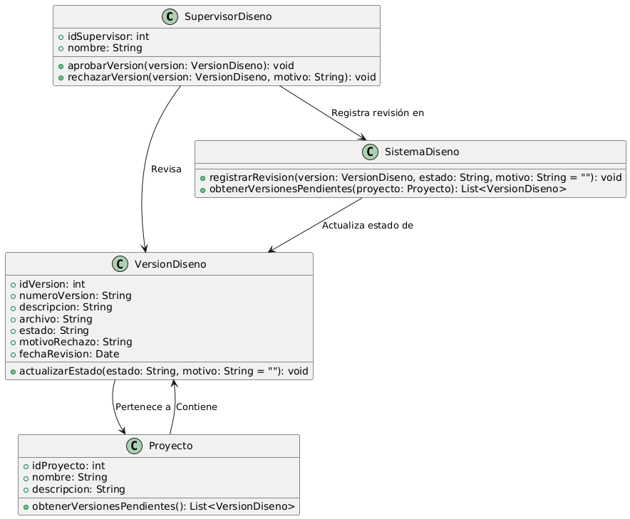

# GESTIÓN DE DISEÑO

------

## Caso de uso historia 
Cesar, supervisor de diseño, recibe una notificación sobre una nueva versión de diseño subida por un diseñador. Accede al sistema, revisa los detalles y las modificaciones realizadas en la versión. Tras evaluar si cumple con los estándares y requisitos del proyecto, Carlos decide aprobarla. El sistema registra la aprobación, actualiza el estado de la versión y la marca como lista para uso. Si detecta problemas, Carlos rechaza la versión, dejando comentarios para que el diseñador realice los ajustes necesarios.

---

  <tr class="idtext principal">
    <td>ID SYN-31</td>
  </tr>
  <tr class="single text">
    <td><strong>Requerimiento</strong>:Aprobar o rechazar versiones de diseño. ID SYN-31</td>
  </tr>
  <tr class="single gray">
    <td><strong>Historia de usuario</strong></td>
  </tr>
  <tr class="single text">
    <td>Como supervisor de diseño quiero aprobar o rechazar versiones de diseño para garantizar que solo las versiones adecuadas y alineadas con los estándares sean utilizadas en los proyectos.
</td>
  </tr>
  <tr class="duo">
    <th class="gray"><strong>Estado de la tarea</strong></th>
    <th>En desarrollo</th>
  </tr>
  <tr class="single gray">
    <td><strong>Caso de uso (Pasos)</strong></td>
  </tr>
  <tr class="single text">
    <td>
        <ol>
            <li>El supervisor accede al sistema y visualiza la lista de versiones de diseño pendientes de aprobación.</li>
            <li>Selecciona una versión específica para revisar.</li>
            <li>Examina el archivo y revisa la descripción proporcionada por el diseñador.</li>
            <li>Decide aprobar o rechazar la versión: Si aprueba: Proporciona un comentario opcional y confirma la aprobación. Si rechaza: Proporciona una razón del rechazo en el campo correspondiente y confirma.</li>
            <li>El sistema actualiza el estado de la versión y notifica al diseñador sobre la decisión.</li>
        </ol>
    </td>
  </tr>
  <tr class="single gray">
    <td><strong>Criterios de aceptación</strong></td>
  </tr>
  <tr class="single text">
    <td>
        <ol>
            <li>El sistema debe permitir que el supervisor solo apruebe o rechace versiones que estén en estado "Pendiente".</li>
            <li>Al rechazar una versión, debe ser obligatorio incluir una justificación.</li>
            <li>Tras la decisión, el sistema debe notificar al diseñador responsable de la versión.</li>
            <li>El estado actualizado de la versión debe reflejarse en la lista de versiones del proyecto.</li>
            <li>El sistema debe almacenar el historial de decisiones (aprobaciones y rechazos) con fecha, hora y comentarios.</li>
            </ol>
 <tr class="duo">
    <th class="gray"><strong>Calidad</strong></th>
    <th>En desarrollo</th>
  </tr>
  <tr class="duo">
    <th class="gray"><strong>Versionamiento</strong></th>
    <th>En desarrollo</th>
  </tr>
</table>

---
## Diagrama de Caso de uso
[Creado con plantuml](https://plantuml.com/es/)

---