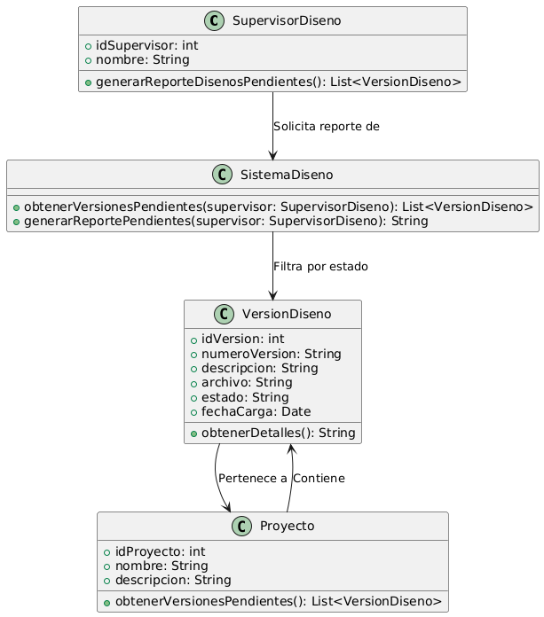

# GESTIÓN DE DISEÑO

------

## Caso de uso historia 
Cesar, supervisor de diseño, necesita priorizar las revisiones de los diseños. Accede al sistema y genera un reporte que muestra todas las versiones pendientes de aprobación, organizadas por fecha de creación y proyecto.El reporte le permite identificar rápidamente las versiones más urgentes, asignar tiempo para revisarlas y asegurar que los proyectos avancen sin demoras.

---

  <tr class="idtext principal">
    <td>ID SYN-32</td>
  </tr>
  <tr class="single text">
    <td><strong>Requerimiento</strong>:Generar reportes de diseños pendientes de aprobación. ID SYN-32</td>
  </tr>
  <tr class="single gray">
    <td><strong>Historia de usuario</strong></td>
  </tr>
  <tr class="single text">
    <td>Como supervisor de diseño quiero generar reportes de diseños pendientes de aprobación, para tener una visión clara de las versiones que requieren revisión y priorizar el trabajo.
</td>
  </tr>
  <tr class="duo">
    <th class="gray"><strong>Estado de la tarea</strong></th>
    <th>En desarrollo</th>
  </tr>
  <tr class="single gray">
    <td><strong>Caso de uso (Pasos)</strong></td>
  </tr>
  <tr class="single text">
    <td>
        <ol>
            <li>El supervisor accede a la sección de reportes en el sistema.</li>
            <li>Selecciona la opción "Reportes de Diseños Pendientes".</li>
            <li>Configura los filtros opcionales, como fecha de carga, proyecto o diseñador responsable.</li>
            <li>Solicita generar el reporte.</li>
            <li>El sistema procesa los datos y genera un documento con la lista de diseños pendientes, incluyendo:Nombre del proyecto,Fecha de carga, responsable, Descripción de la versión.</li>
            <li>El supervisor visualiza el reporte en pantalla y tiene la opción de descargarlo en formato PDF o Excel.</li>
        </ol>
    </td>
  </tr>
  <tr class="single gray">
    <td><strong>Criterios de aceptación</strong></td>
  </tr>
  <tr class="single text">
    <td>
        <ol>
            <li>El sistema debe permitir al supervisor generar reportes en cualquier momento.</li>
            <li>Los filtros de búsqueda deben incluir criterios como rango de fechas, nombre del proyecto y diseñador.</li>
            <li>El reporte generado debe incluir detalles relevantes: proyecto, diseñador, descripción, fecha de carga y estado.</li>
            <li>El sistema debe permitir descargar el reporte en formato PDF o Excel.</li>
            <li>Si no hay diseños pendientes, el sistema debe notificar:"No hay diseños pendientes de aprobación con los filtros seleccionados".</li>
            </ol>
 <tr class="duo">
    <th class="gray"><strong>Calidad</strong></th>
    <th>En desarrollo</th>
  </tr>
  <tr class="duo">
    <th class="gray"><strong>Versionamiento</strong></th>
    <th>En desarrollo</th>
  </tr>
</table>

---
## Diagrama de Caso de uso
[Creado con plantuml](https://plantuml.com/es/)

---