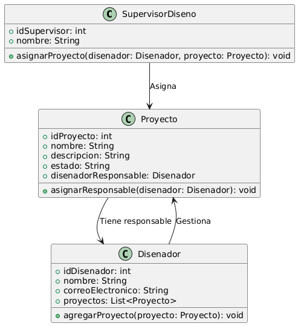

# GESTIÓN DE DISEÑO

------

## Caso de uso historia 
Cesar, supervisor de diseño, accede al sistema para organizar los proyectos en curso. Selecciona un proyecto recién creado y asigna a Laura, una diseñadora, como responsable principal. El sistema notifica a Laura sobre su nueva asignación y actualiza el registro del proyecto con su nombre, asegurando una distribución clara y eficiente de las tareas entre el equipo.

---

  <tr class="idtext principal">
    <td>ID SYN-34</td>
  </tr>
  <tr class="single text">
    <td><strong>Requerimiento</strong>:Asignar proyectos a diseñadores. ID SYN-34</td>
  </tr>
  <tr class="single gray">
    <td><strong>Historia de usuario</strong></td>
  </tr>
  <tr class="single text">
    <td>Como supervisor de diseño quiero asignar proyectos a diseñadores para garantizar que cada proyecto tenga un responsable y que las tareas se distribuyan eficientemente.
</td>
  </tr>
  <tr class="duo">
    <th class="gray"><strong>Estado de la tarea</strong></th>
    <th>En desarrollo</th>
  </tr>
  <tr class="single gray">
    <td><strong>Caso de uso (Pasos)</strong></td>
  </tr>
  <tr class="single text">
    <td>
        <ol>
            <li>El supervisor accede a la lista de proyectos.</li>
            <li>Selecciona un proyecto específico para asignar.</li>
            <li>Busca en la lista de diseñadores disponibles y selecciona uno.</li>
            <li>Confirma la asignación.</li>
            <li>El sistema registra la asignación y envía una notificación al diseñador con los detalles del proyecto asignado.</li>
        </ol>
    </td>
  </tr>
  <tr class="single gray">
    <td><strong>Criterios de aceptación</strong></td>
  </tr>
  <tr class="single text">
    <td>
        <ol>
            <li>El sistema debe permitir al supervisor asignar uno o más diseñadores a un proyecto.</li>
            <li>La interfaz debe mostrar una lista actualizada de diseñadores disponibles.</li>
            <li>Tras la asignación, el sistema debe enviar automáticamente una notificación al diseñador asignado.</li>
            <li>Si el proyecto ya tiene un diseñador asignado, el sistema debe notificar al supervisor:"Este proyecto ya tiene un diseñador asignado. ¿Desea reemplazarlo?"</li>
            <li>El sistema debe registrar la asignación en el historial del proyecto.</li>
            </ol>
 <tr class="duo">
    <th class="gray"><strong>Calidad</strong></th>
    <th>En desarrollo</th>
  </tr>
  <tr class="duo">
    <th class="gray"><strong>Versionamiento</strong></th>
    <th>En desarrollo</th>
  </tr>
</table>

---
## Diagrama de Caso de uso
[Creado con plantuml](https://plantuml.com/es/)

---