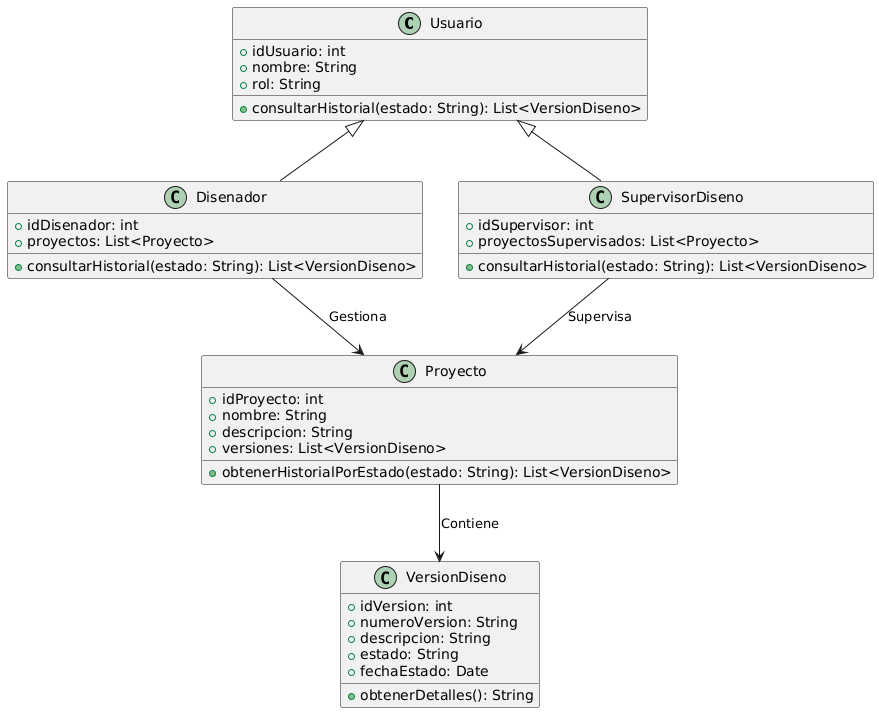

# GESTIÓN DE DISEÑO

------

## Caso de uso historia 
Laura, diseñadora, necesita revisar las decisiones previas relacionadas con un proyecto en curso. Accede al sistema y consulta el historial de diseños aprobados o rechazados, donde encuentra detalles como fechas, comentarios del supervisor y el estado de cada versión. Esta información le permite comprender el contexto de las decisiones, ajustar sus próximas propuestas y garantizar que estén alineadas con los estándares establecidos.

---

  <tr class="idtext principal">
    <td>ID SYN-35</td>
  </tr>
  <tr class="single text">
    <td><strong>Requerimiento</strong>:Consultar el historial de versiones aprobadas o rechazadas. ID SYN-35</td>
  </tr>
  <tr class="single gray">
    <td><strong>Historia de usuario</strong></td>
  </tr>
  <tr class="single text">
    <td>Como diseñador o supervisor quiero consultar el historial de diseños aprobados o rechazados para revisar decisiones previas y hacer seguimiento al estado de los proyectos.
</td>
  </tr>
  <tr class="duo">
    <th class="gray"><strong>Estado de la tarea</strong></th>
    <th>En desarrollo</th>
  </tr>
  <tr class="single gray">
    <td><strong>Caso de uso (Pasos)</strong></td>
  </tr>
  <tr class="single text">
    <td>
        <ol>
            <li>El usuario accede a la sección de "Historial de Diseños".</li>
            <li>Filtra los resultados por criterios como: Estado del diseño (aprobado/rechazado), Proyecto asociado, Fecha de aprobación o rechazo.</li>
            <li>El sistema muestra una lista con los diseños que cumplen los criterios seleccionados.</li>
            <li>El usuario selecciona un diseño específico para ver detalles adicionales, incluyendo: Comentarios del revisor, Fecha de la decisión, Responsable de la revisión.</li>
        </ol>
    </td>
  </tr>
  <tr class="single gray">
    <td><strong>Criterios de aceptación</strong></td>
  </tr>
  <tr class="single text">
    <td>
        <ol>
            <li>El sistema debe permitir filtrar el historial por estado (aprobado/rechazado), proyecto y fecha.</li>
            <li>El sistema debe mostrar detalles del diseño, como comentarios, fecha y responsable de la decisión.</li>
            <li>Si no hay registros que coincidan con los filtros aplicados, el sistema debe notificar al usuario.</li>
            </ol>
 <tr class="duo">
    <th class="gray"><strong>Calidad</strong></th>
    <th>En desarrollo</th>
  </tr>
  <tr class="duo">
    <th class="gray"><strong>Versionamiento</strong></th>
    <th>En desarrollo</th>
  </tr>
</table>

---
## Diagrama de Caso de uso
[Creado con plantuml](https://plantuml.com/es/)

---