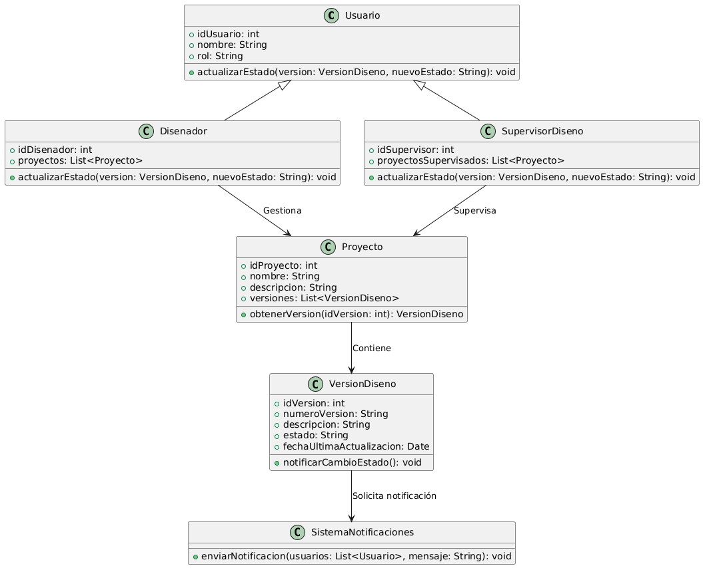

# GESTIÓN DE DISEÑO

------

## Caso de uso historia 
Cesar, supervisor de diseño, revisa una propuesta enviada por un diseñador. Una vez evaluada, actualiza el estado del diseño en el sistema, marcándolo como "En revisión", "Aprobado" o "Rechazado", según corresponda. El sistema registra el cambio de estado y notifica automáticamente a los interesados, asegurando que todos estén al tanto del progreso o decisiones tomadas respecto al diseño.

---

  <tr class="idtext principal">
    <td>ID SYN-36</td>
  </tr>
  <tr class="single text">
    <td><strong>Requerimiento</strong>:Actualizar el estado de un proyecto. ID SYN-36</td>
  </tr>
  <tr class="single gray">
    <td><strong>Historia de usuario</strong></td>
  </tr>
  <tr class="single text">
    <td>Como diseñador o supervisor quiero actualizar el estado de un diseño para reflejar su progreso o decisiones tomadas, y mantener a los interesados informados.
</td>
  </tr>
  <tr class="duo">
    <th class="gray"><strong>Estado de la tarea</strong></th>
    <th>En desarrollo</th>
  </tr>
  <tr class="single gray">
    <td><strong>Caso de uso (Pasos)</strong></td>
  </tr>
  <tr class="single text">
    <td>
        <ol>
            <li>El usuario accede al módulo de diseños.</li>
            <li>Selecciona un diseño de la lista.</li>
            <li>ambia el estado del diseño seleccionando una de las opciones disponibles, como:En progreso, Aprobado, Rechazado, En revisión.</li>
            <li>Confirma la actualización del estado.</li>
            <li>El sistema guarda el cambio, registra la acción en el historial y notifica a los interesados relevantes.</li>
        </ol>
    </td>
  </tr>
  <tr class="single gray">
    <td><strong>Criterios de aceptación</strong></td>
  </tr>
  <tr class="single text">
    <td>
        <ol>
            <li>El sistema debe permitir al usuario cambiar el estado de un diseño con opciones predeterminadas.</li>
            <li>El sistema debe registrar el cambio de estado con la fecha, hora y el responsable de la acción.</li>
            <li>Una notificación debe enviarse automáticamente a los interesados asociados al diseño tras el cambio de estado.</li>
            <li>Si el estado seleccionado no es válido o no aplica, el sistema debe mostrar un mensaje de error.</li>
            </ol>
 <tr class="duo">
    <th class="gray"><strong>Calidad</strong></th>
    <th>En desarrollo</th>
  </tr>
  <tr class="duo">
    <th class="gray"><strong>Versionamiento</strong></th>
    <th>En desarrollo</th>
  </tr>
</table>

---
## Diagrama de Caso de uso
[Creado con plantuml](https://plantuml.com/es/)

---