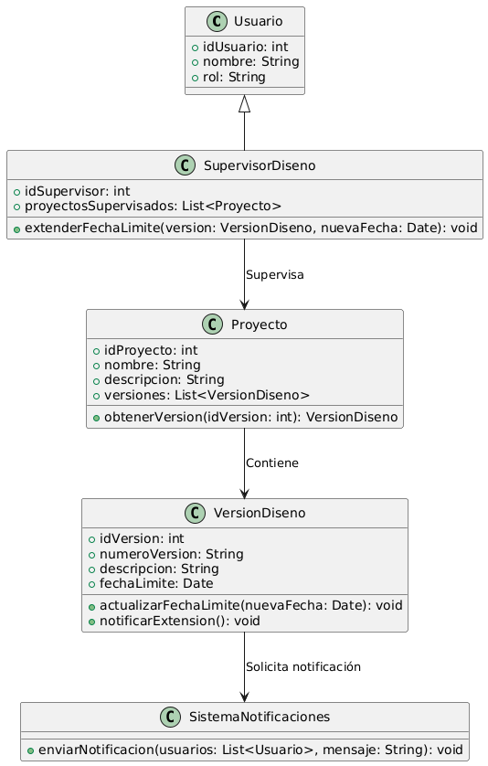

# GESTIÓN DE DISEÑO

------

## Caso de uso historia 
Cesar, supervisor de diseño, revisa un proyecto que enfrenta retrasos debido a cambios en los requerimientos. Accede al sistema, localiza el diseño afectado y ajusta la fecha límite para otorgar más tiempo al equipo. El sistema actualiza automáticamente el cronograma y notifica al diseñador encargado, asegurando que el diseño pueda completarse sin comprometer la calidad.

---

  <tr class="idtext principal">
    <td>ID SYN-37</td>
  </tr>
  <tr class="single text">
    <td><strong>Requerimiento</strong>:Extender fechas límite de proyectos. ID SYN-37</td>
  </tr>
  <tr class="single gray">
    <td><strong>Historia de usuario</strong></td>
  </tr>
  <tr class="single text">
    <td>Como supervisor de diseño quiero extender las fechas límite de un diseño para asegurarme de que el diseño pueda completarse adecuadamente, en caso de retrasos o cambios en los requerimientos.
</td>
  </tr>
  <tr class="duo">
    <th class="gray"><strong>Estado de la tarea</strong></th>
    <th>En desarrollo</th>
  </tr>
  <tr class="single gray">
    <td><strong>Caso de uso (Pasos)</strong></td>
  </tr>
  <tr class="single text">
    <td>
        <ol>
            <li>El supervisor accede al módulo de diseño y selecciona el diseño que necesita modificar.</li>
            <li>Revisa la fecha límite actual del diseño.</li>
            <li>Cambia la fecha límite seleccionando una nueva fecha dentro de un rango permitido.</li>
            <li>El supervisor confirma el cambio de fecha.</li>
            <li>El sistema guarda el cambio, registra la actualización en el historial del diseño y notifica a los involucrados (diseñadores, equipo de proyecto).</li>
        </ol>
    </td>
  </tr>
  <tr class="single gray">
    <td><strong>Criterios de aceptación</strong></td>
  </tr>
  <tr class="single text">
    <td>
        <ol>
            <li>El sistema debe permitir a los supervisores modificar la fecha límite del diseño, seleccionando una nueva fecha válida.</li>
            <li>El sistema debe registrar cada cambio de fecha límite con la fecha, hora y responsable de la modificación.</li>
            <li>El sistema debe verificar que la fecha límite seleccionada sea válida, dentro de los parámetros establecidos.</li>
            <li>Los interesados deben recibir una notificación automática con la nueva fecha límite.</li>
            <li>El sistema debe permitir realizar cambios solo a aquellos diseños cuyo estado lo permita (por ejemplo, si está "En progreso" o "En revisión").</li>
            </ol>
 <tr class="duo">
    <th class="gray"><strong>Calidad</strong></th>
    <th>En desarrollo</th>
  </tr>
  <tr class="duo">
    <th class="gray"><strong>Versionamiento</strong></th>
    <th>En desarrollo</th>
  </tr>
</table>

---
## Diagrama de Caso de uso
[Creado con plantuml](https://plantuml.com/es/)

---