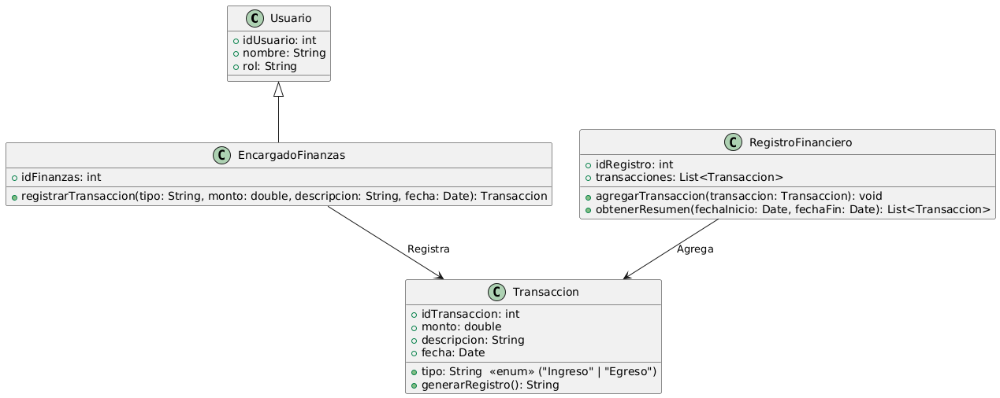

# GESTIÓN FINANCIERA 

------

## Caso de uso historia 
Sofía, encargada de finanzas, recibe información sobre un ingreso por pago de un cliente. Accede al sistema financiero, selecciona la opción "Registrar Transacción" e ingresa los detalles como monto, fecha, concepto y tipo de transacción (ingreso). Del mismo modo, Sofía registra un egreso correspondiente al pago de insumos para producción. El sistema actualiza automáticamente los balances y genera registros contables, permitiendo a Sofía llevar un control preciso de las operaciones financieras.

---

  <tr class="idtext principal">
    <td>ID SYN-38</td>
  </tr>
  <tr class="single text">
    <td><strong>Requerimiento</strong>:Registrar transacciones de ingresos y egresos. ID SYN-38</td>
  </tr>
  <tr class="single gray">
    <td><strong>Historia de usuario</strong></td>
  </tr>
  <tr class="single text">
    <td>Como encargado de finanzas quiero registrar transacciones de ingresos y egresos para llevar un control preciso de las operaciones financieras y mantener la contabilidad actualizada.
</td>
  </tr>
  <tr class="duo">
    <th class="gray"><strong>Estado de la tarea</strong></th>
    <th>En desarrollo</th>
  </tr>
  <tr class="single gray">
    <td><strong>Caso de uso (Pasos)</strong></td>
  </tr>
  <tr class="single text">
    <td>
        <ol>
            <li>
             <li>El encargado de finanzas accede al módulo de transacciones en el sistema.</li>
            <li>El usuario selecciona si la transacción es de ingreso o egreso.</li>
            <li>El usuario ingresa los siguientes datos: Monto de la transacción, Fecha de la transacción, Descripción de la transacción, Categoría (por ejemplo, ventas, compras, servicios, etc.), Método de pago (por ejemplo, efectivo, transferencia, tarjeta, etc.).</li>
            <li>El encargado de finanzas confirma la transacción.</li>
            <li>El sistema guarda la transacción, actualiza el balance y genera una entrada en el historial financiero.</li>
        </ol>
    </td>
  </tr>
  <tr class="single gray">
    <td><strong>Criterios de aceptación</strong></td>
  </tr>
  <tr class="single text">
    <td>
        <ol>
              <li>El sistema debe permitir al usuario registrar tanto ingresos como egresos, diferenciándolos claramente.</li>
              <li>El sistema debe validar que todos los campos obligatorios sean completados antes de permitir guardar la transacción.</li>
              <li>El sistema debe actualizar el balance financiero automáticamente tras registrar la transacción.</li>
              <li>La transacción debe quedar registrada en el historial con los detalles completos: monto, fecha, descripción, y categoría.</li>
              <li>El sistema debe notificar al usuario si la transacción no se pudo registrar debido a errores de validación.</li>
            </ol>
 <tr class="duo">
    <th class="gray"><strong>Calidad</strong></th>
    <th>En desarrollo</th>
  </tr>
  <tr class="duo">
    <th class="gray"><strong>Versionamiento</strong></th>
    <th>En desarrollo</th>
  </tr>
</table>

---
## Diagrama de Caso de uso
[Creado con plantuml](https://plantuml.com/es/)

---
 