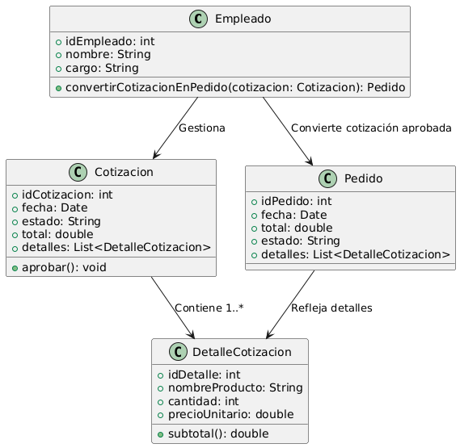

# GESTIÓN DE VENTAS

------

## Caso de uso historia 
Juan, empleado del área de ventas, recibe la aprobación de Pedro Martínez para la cotización. Accede al sistema y convierte la cotización aprobada en un pedido, asegurando que todos los detalles (productos, precios, impuestos, etc.) se transfieran automáticamente. El pedido se registra con un código único y se envía a diseño, producción y logística para su procesamiento.

---

<table id="customers">
  <tr class="idtext principal">
    <td>ID SYN-4</td>
  </tr>
  <tr class="single text">
    <td><strong>Requerimiento</strong>: Convertir cotizaciones aprobadas en pedidos. ID SYN-4</td>
  </tr>
  <tr class="single gray">
    <td><strong>Historia de usuario</strong></td>
  </tr>
  <tr class="single text">
    <td>Como empleado del área de ventas quiero poder convertir una cotización aprobada en un pedido para formalizar la venta y proceder con la producción, envío o entrega del producto, asegurando que los detalles de la cotización sean reflejados en el pedido final.</td>
  </tr>
  <tr class="duo">
    <th class="gray"><strong>Estado de la tarea</strong></th>
    <th>En desarrollo</th>
  </tr>
  <tr class="single gray">
    <td><strong>Caso de uso (Pasos)</strong></td>
  </tr>
  <tr class="single text">
    <td>
        <ol>
            <li>El empleado accede al sistema de gestión de cotizaciones y selecciona una cotización aprobada.</li>
            <li>El empleado revisa los detalles de la cotización para asegurarse de que los productos y precios son correctos.</li>
            <li>El sistema muestra una opción para convertir la cotización aprobada en un pedido.</li>
            <li>El empleado selecciona la opción de "Convertir a Pedido".</li>
            <li>El sistema transfiere automáticamente los detalles de la cotización al pedido.</li>
            <li>El sistema genera un nuevo pedido con un número de identificación único.</li>
            <li>El empleado revisa los detalles del pedido (productos, cantidades, precios) y confirma que están correctos.</li>
            <li>El sistema marca el pedido como "Nuevo" o "Pendiente de Producción".</li>
            <li>El sistema cambia el estado de la cotización a "Convertida en Pedido".</li>
            <li>El sistema genera una notificación para confirmar que la conversión fue exitosa.</li>
    </td>
  </tr>
  <tr class="single gray">
    <td><strong>Criterios de Aceptación</strong></td>
  </tr>
  <tr class="single text">
    <td>
        <ol>
            <li>El sistema debe permitir convertir una cotización aprobada en un pedido automáticamente, manteniendo todos los detalles relevantes.</li>
            <li> Una vez convertida, la cotización debe tener el estado actualizado a "Convertida en Pedido", de modo que no sea aprobada nuevamente.</li>
            <li>El sistema debe generar un nuevo pedido con un número de identificación único que esté vinculado a la cotización convertida.</li>
            <li>El sistema debe proporcionar una confirmación de que la cotización ha sido convertida en un pedido exitosamente.</li>
            <li>El pedido debe ser accesible en el sistema, permitiendo su visualización y edición por parte de los empleados del área de ventas.</li>
            <li>Después de convertir la cotización en un pedido, el sistema debe enviar una notificación (ya sea por correo o en la interfaz) indicando que la conversión fue exitosa.</li>
        </ol>
    </td>
  </tr>
 <tr class="duo">
    <th class="gray"><strong>Calidad</strong></th>
    <th>En desarrollo</th>
  </tr>
  <tr class="duo">
    <th class="gray"><strong>Versionamiento</strong></th>
    <th>En desarrollo</th>
  </tr>
</table>

---
## Diagrama de Caso de uso
[Creado con plantuml](https://plantuml.com/es/)

---
