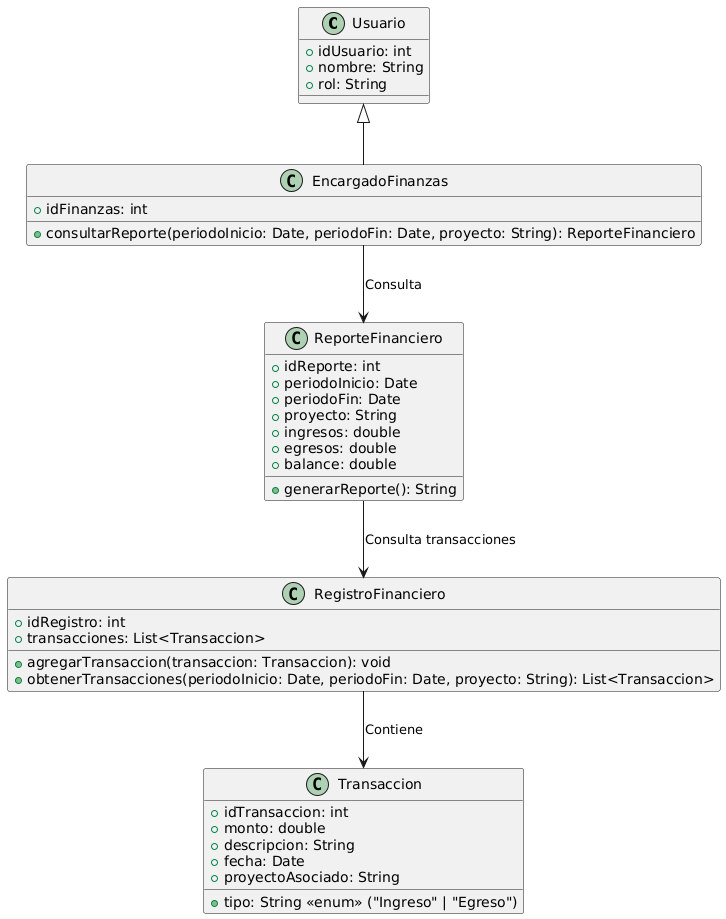

# GESTIÓN FINANCIERA

------

## Caso de uso historia 
Sofía, encargada de finanzas, necesita evaluar el estado financiero de un proyecto específico. Accede al sistema, selecciona la opción "Generar Reporte Financiero" y define los parámetros de búsqueda: el proyecto y el período de tiempo. El sistema genera un informe detallado que incluye ingresos, egresos y el balance financiero. Con esta información, Sofía identifica posibles desviaciones presupuestarias y toma decisiones para mantener las finanzas bajo control.

---

  <tr class="idtext principal">
    <td>ID SYN-40</td>
  </tr>
  <tr class="single text">
    <td><strong>Requerimiento</strong>:Consultar reportes financieros por período o proyecto. ID SYN-40</td>
  </tr>
  <tr class="single gray">
    <td><strong>Historia de usuario</strong></td>
  </tr>
  <tr class="single text">
    <td>Como encargado de finanzas quiero consultar reportes financieros por período o proyecto para tener un control detallado de los ingresos, egresos y el estado financiero en función de proyectos o rangos de tiempo específicos.
</td>
  </tr>
  <tr class="duo">
    <th class="gray"><strong>Estado de la tarea</strong></th>
    <th>En desarrollo</th>
  </tr>
  <tr class="single gray">
    <td><strong>Caso de uso (Pasos)</strong></td>
  </tr>
  <tr class="single text">
    <td>
        <ol>
            <li>
             <li>El encargado de finanzas accede al módulo de reportes financieros en el sistema.</li>
              <li>El usuario selecciona los filtros para generar el reporte.</li>
              <li>El encargado de finanzas selecciona el tipo de reporte que desea consultar (ingresos, egresos, balance general, etc.).</li>
              <li>El sistema genera el reporte con los datos financieros filtrados por el período o el proyecto seleccionado.</li>
              <li>El encargado de finanzas visualiza el reporte detallado y tiene la opción de exportarlo en formato PDF o Excel.</li>
    </td>
  </tr>
  <tr class="single gray">
    <td><strong>Criterios de aceptación</strong></td>
  </tr>
  <tr class="single text">
    <td>
        <ol>
              <li>El sistema debe permitir al usuario filtrar los reportes financieros por período o proyecto.</li>
              <li>El sistema debe generar reportes detallados con la información financiera correspondiente (ingresos, egresos, balance).</li>
              <li>El sistema debe mostrar un mensaje si no hay datos disponibles para el filtro seleccionado.</li>
              <li>El sistema debe permitir al usuario exportar los reportes en formato PDF o Excel.</li>
              <li>El reporte generado debe ser visualmente claro y organizado, con las categorías y montos correctamente detallados.</li>
            </ol>
 <tr class="duo">
    <th class="gray"><strong>Calidad</strong></th>
    <th>En desarrollo</th>
  </tr>
  <tr class="duo">
    <th class="gray"><strong>Versionamiento</strong></th>
    <th>En desarrollo</th>
  </tr>
</table>

---
## Diagrama de Caso de uso
[Creado con plantuml](https://plantuml.com/es/)

---