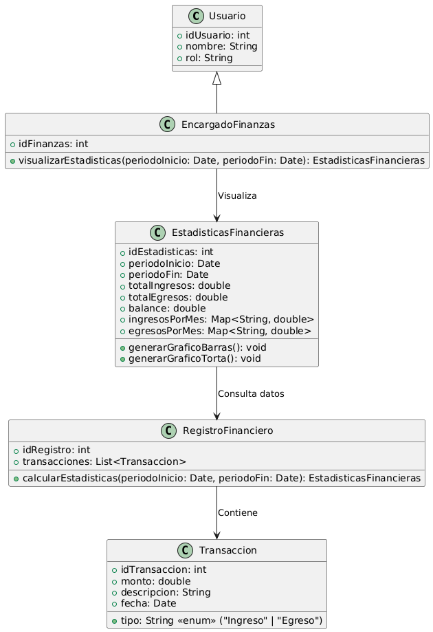

# GESTIÓN FINANCIERA

------

## Caso de uso historia 
Sofía, encargada de finanzas, accede al módulo de estadísticas financieras del sistema. Allí, visualiza gráficos y tablas que resumen los ingresos y egresos de la empresa en diferentes períodos. Estas estadísticas le permiten identificar tendencias, como aumentos en los gastos o disminuciones en los ingresos, y tomar decisiones informadas para optimizar el manejo financiero de la empresa.

---

  <tr class="idtext principal">
    <td>ID SYN-41</td>
  </tr>
  <tr class="single text">
    <td><strong>Requerimiento</strong>:Visualizar estadísticas de ingresos y egresos. ID SYN-41</td>
  </tr>
  <tr class="single gray">
    <td><strong>Historia de usuario</strong></td>
  </tr>
  <tr class="single text">
    <td>Como encargado de finanzas quiero visualizar estadísticas de ingresos y egresos para obtener una visión clara del flujo de dinero y tomar decisiones informadas sobre el estado financiero de la empresa.
</td>
  </tr>
  <tr class="duo">
    <th class="gray"><strong>Estado de la tarea</strong></th>
    <th>En desarrollo</th>
  </tr>
  <tr class="single gray">
    <td><strong>Caso de uso (Pasos)</strong></td>
  </tr>
  <tr class="single text">
    <td>
        <ol>
            <li>
             <li>El encargado de finanzas accede al módulo de estadísticas financieras en el sistema.</li>
            <li>El sistema presenta opciones para seleccionar el tipo de estadísticas a visualizar: Ingresos, Egresos, Balance general: Diferencia entre ingresos y egresos en un período determinado.</li>
            <li>El encargado selecciona un período (por ejemplo, mes, trimestre, año) o rango personalizado de fechas.</li>
            <li>El sistema genera las estadísticas correspondientes y las presenta visualmente con gráficos (barras, líneas, pastel, etc.).</li>
            <li>El encargado puede filtrar los datos por categorías (por ejemplo, tipo de ingreso o egreso, proyectos, departamentos, etc.) para obtener estadísticas más detalladas.</li>
            <li>El encargado de finanzas puede exportar las estadísticas a formatos PDF o Excel para análisis posterior.</li>
    </td>
  </tr>
  <tr class="single gray">
    <td><strong>Criterios de aceptación</strong></td>
  </tr>
  <tr class="single text">
    <td>
        <ol>
              <li>El sistema debe generar estadísticas de ingresos, egresos o balance general según el período seleccionado.</li>
              <li>El sistema debe presentar las estadísticas de manera visual, utilizando gráficos fáciles de interpretar.</li>
              <li>El sistema debe permitir la selección de diferentes filtros, como período o categoría (tipo de ingreso, egreso, etc.).</li>
              <li>El sistema debe permitir exportar las estadísticas a formatos PDF o Excel.</li>
              <li>Si no existen datos registrados en el período o categoría seleccionados, el sistema debe mostrar un mensaje claro indicando que no se encontraron datos.</li>
            </ol>
 <tr class="duo">
    <th class="gray"><strong>Calidad</strong></th>
    <th>En desarrollo</th>
  </tr>
  <tr class="duo">
    <th class="gray"><strong>Versionamiento</strong></th>
    <th>En desarrollo</th>
  </tr>
</table>

---
## Diagrama de Caso de uso
[Creado con plantuml](https://plantuml.com/es/)

---
