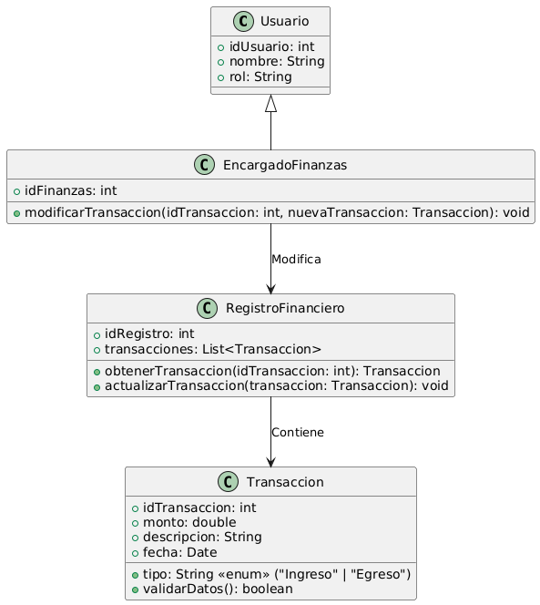

# GESTIÓN FINANCIERA

------

## Caso de uso historia 
Sofía, encargada de finanzas, detecta un error en una transacción registrada como ingreso en lugar de egreso. Accede al sistema financiero, localiza la transacción en el historial y la edita para corregir el tipo, el monto o cualquier otro detalle necesario. El sistema actualiza automáticamente los registros contables, asegurando que los informes financieros reflejen la información correcta y confiable.

---

  <tr class="idtext principal">
    <td>ID SYN-43</td>
  </tr>
  <tr class="single text">
    <td><strong>Requerimiento</strong>:Modificar transacciones incorrectas. ID SYN-43</td>
  </tr>
  <tr class="single gray">
    <td><strong>Historia de usuario</strong></td>
  </tr>
  <tr class="single text">
    <td>Como encargado de finanzas quiero modificar transacciones incorrectas para corregir errores en los registros financieros y asegurar que los informes sean precisos y confiables.
</td>
  </tr>
  <tr class="duo">
    <th class="gray"><strong>Estado de la tarea</strong></th>
    <th>En desarrollo</th>
  </tr>
  <tr class="single gray">
    <td><strong>Caso de uso (Pasos)</strong></td>
  </tr>
  <tr class="single text">
    <td>
        <ol>
            <li>
             <li>El encargado de finanzas accede al sistema de gestión financiera.</li>
            <li>El encargado busca la transacción incorrecta utilizando filtros como fecha, tipo de transacción, monto, etc.</li>
            <li>El sistema muestra la transacción seleccionada y proporciona la opción de editar.</li>
            <li>El encargado selecciona la opción de "Modificar".</li>
            <li>El sistema permite al encargado editar los detalles de la transacción (monto, tipo de transacción, cuenta asociada, etc.).</li>
            <li>El encargado realiza los cambios necesarios y guarda la transacción modificada.</li>
            <li>El sistema actualiza la transacción y guarda los cambios realizados.</li>
            <li>El encargado recibe una confirmación de que la transacción ha sido modificada exitosamente.</li>
          </ol>
   </td>
  </tr>
  <tr class="single gray">
    <td><strong>Criterios de aceptación</strong></td>
  </tr>
  <tr class="single text">
    <td>
        <ol>
              <li>El sistema debe permitir al encargado de finanzas modificar transacciones incorrectas mientras estas no estén finalizadas o aprobadas.</li>
              <li>El encargado de finanzas debe ser capaz de editar los detalles clave de la transacción, como monto, tipo, cuenta asociada, etc.</li>
              <li>El sistema debe guardar un historial de las modificaciones realizadas, incluyendo el usuario y la fecha de la modificación.</li>
              <li>Si la transacción está finalizada o aprobada, el sistema debe mostrar un mensaje claro que indique que no se puede modificar.</li>
              <li>El sistema debe asegurar que solo los usuarios con permisos adecuados puedan modificar las transacciones.</li>
              <li>El encargado debe recibir una confirmación de que la transacción fue modificada con éxito.</li>
            </ol>
 <tr class="duo">
    <th class="gray"><strong>Calidad</strong></th>
    <th>En desarrollo</th>
  </tr>
  <tr class="duo">
    <th class="gray"><strong>Versionamiento</strong></th>
    <th>En desarrollo</th>
  </tr>
</table>

---
## Diagrama de Caso de uso
[Creado con plantuml](https://plantuml.com/es/)

---
 