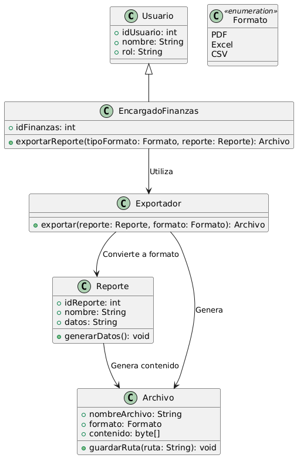

# GESTIÓN FINANCIERA

------

## Caso de uso historia 
Sofía, encargada de finanzas, necesita compartir un informe financiero mensual con el equipo directivo. Accede al sistema, genera el reporte requerido y selecciona la opción para exportarlo en formato PDF o Excel. El archivo exportado se guarda en su dispositivo, permitiéndole enviarlo por correo electrónico o presentarlo en una reunión, facilitando el análisis y discusión fuera del sistema.

---

  <tr class="idtext principal">
    <td>ID SYN-44</td>
  </tr>
  <tr class="single text">
    <td><strong>Requerimiento</strong>:Exportar reportes financieros en diferentes formatos. ID SYN-44</td>
  </tr>
  <tr class="single gray">
    <td><strong>Historia de usuario</strong></td>
  </tr>
  <tr class="single text">
    <td>Como encargado de finanzas quiero modificar transacciones incorrectas para corregir errores en los registros financieros y asegurar que los informes sean precisos y confiables.
</td>
  </tr>
  <tr class="duo">
    <th class="gray"><strong>Estado de la tarea</strong></th>
    <th>En desarrollo</th>
  </tr>
  <tr class="single gray">
    <td><strong>Caso de uso (Pasos)</strong></td>
  </tr>
  <tr class="single text">
    <td>
        <ol>
            <li>
             <li>El encargado de finanzas inicia sesión en el sistema de gestión financiera.</li>
            <li>El encargado accede a la sección de reportes financieros.</li>
            <li>El encargado selecciona el reporte financiero que desea exportar (por ejemplo, reportes de ingresos, egresos, balance general).</li>
            <li>El sistema muestra los reportes disponibles y una opción para exportarlos.</li>
            <li>El encargado selecciona el formato de exportación deseado (PDF, Excel, CSV).</li>
            <li>El sistema procesa la solicitud y genera el reporte en el formato elegido.</li>
            <li>El sistema permite al encargado descargar el reporte exportado a su dispositivo.</li>
            <li>El encargado recibe una confirmación de que el reporte ha sido exportado exitosamente.</li>
          </ol>
   </td>
  </tr>
  <tr class="single gray">
    <td><strong>Criterios de aceptación</strong></td>
  </tr>
  <tr class="single text">
    <td>
        <ol>
              <li>El sistema debe permitir la exportación de reportes financieros en al menos tres formatos: PDF, Excel (XLSX), y CSV.</li>
              <li>El encargado de finanzas debe poder seleccionar el formato de exportación antes de descargar el reporte.</li>
              <li>El sistema debe mostrar un mensaje de confirmación una vez que el reporte ha sido exportado exitosamente.</li>
              <li>Si el encargado no tiene permisos suficientes, el sistema debe mostrar un mensaje claro que indique la falta de permisos.</li>
              <li>Si hay un error al exportar el reporte, el sistema debe mostrar un mensaje de error explicando la causa (por ejemplo, "Error al generar el reporte").</li>
              <li>El sistema debe permitir la exportación de cualquier tipo de reporte generado dentro del sistema (ingresos, egresos, balance, etc.).</li>
              <li>El reporte exportado debe mantener la integridad de los datos, sin alteraciones en la información.</li>
            </ol>
 <tr class="duo">
    <th class="gray"><strong>Calidad</strong></th>
    <th>En desarrollo</th>
  </tr>
  <tr class="duo">
    <th class="gray"><strong>Versionamiento</strong></th>
    <th>En desarrollo</th>
  </tr>
</table>

---
## Diagrama de Caso de uso
[Creado con plantuml](https://plantuml.com/es/)

---