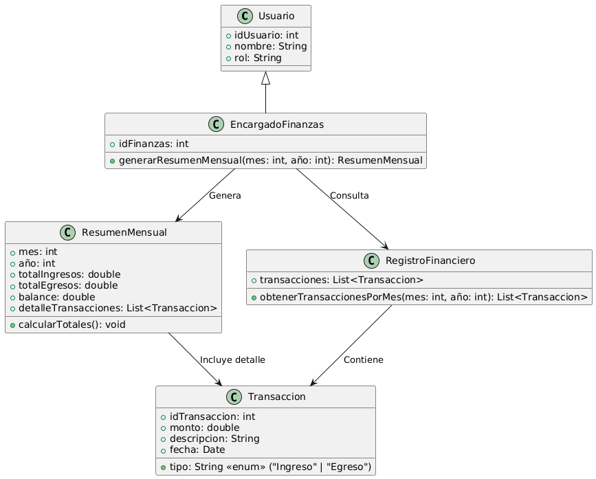

# GESTIÓN FINANCIERA

------

## Caso de uso historia 
Sofía, encargada de finanzas, necesita revisar el balance del último mes. Accede al sistema, selecciona la opción "Resumen Mensual", y elige el mes correspondiente. El sistema genera un reporte consolidado que detalla los ingresos, egresos y el balance total, permitiendo a Sofía identificar tendencias financieras y tomar decisiones informadas.

---

  <tr class="idtext principal">
    <td>ID SYN-45</td>
  </tr>
  <tr class="single text">
    <td><strong>Requerimiento</strong>:Generar resúmenes mensuales de transacciones. ID SYN-45</td>
  </tr>
  <tr class="single gray">
    <td><strong>Historia de usuario</strong></td>
  </tr>
  <tr class="single text">
    <td>Como encargado de finanzas quiero modificar transacciones incorrectas para corregir errores en los registros financieros y asegurar que los informes sean precisos y confiables.
</td>
  </tr>
  <tr class="duo">
    <th class="gray"><strong>Estado de la tarea</strong></th>
    <th>En desarrollo</th>
  </tr>
  <tr class="single gray">
    <td><strong>Caso de uso (Pasos)</strong></td>
  </tr>
  <tr class="single text">
    <td>
        <ol>
            <li>
             <li>El encargado de finanzas inicia sesión en el sistema de gestión financiera.</li>
            <li>El encargado accede a la sección de reportes financieros.</li>
            <li>El encargado selecciona la opción para generar un resumen mensual de transacciones.</li>
            <li>El sistema solicita al encargado seleccionar el mes y año para el cual desea generar el resumen.</li>
            <li>El encargado selecciona el mes y año correspondientes.</li>
            <li>El sistema genera el resumen mensual, mostrando la información consolidada de todas las transacciones (ingresos y egresos) para el mes seleccionado.</li>
            <li>El encargado revisa el resumen, que incluye un desglose de las transacciones por tipo (ingresos, egresos, otros) y el total mensual.</li>
            <li>El sistema permite al encargado exportar o imprimir el resumen generado.</li>
            <li>El encargado recibe una confirmación de que el resumen ha sido generado exitosamente.</li>
          </ol>
   </td>
  </tr>
  <tr class="single gray">
    <td><strong>Criterios de aceptación</strong></td>
  </tr>
  <tr class="single text">
    <td>
        <ol>
              <li>El sistema debe permitir al encargado de finanzas seleccionar el mes y año para generar el resumen mensual de transacciones.</li>
              <li>El sistema debe generar el resumen mensual consolidando todas las transacciones (ingresos y egresos) para el mes seleccionado.</li>
              <li>El resumen debe incluir detalles como el total de ingresos, total de egresos, y un desglose por tipo de transacción.</li>
              <li>El encargado debe poder exportar o imprimir el resumen generado.</li>
              <li>El sistema debe mostrar un mensaje de confirmación una vez que el resumen haya sido generado exitosamente.</li>
              <li>Si no existen transacciones para el mes seleccionado, el sistema debe mostrar un mensaje indicando que no hay registros para ese mes.</li>
              <li>Si el encargado no tiene permisos para generar el resumen, el sistema debe mostrar un mensaje de error indicando la falta de permisos.</li>
            </ol>
 <tr class="duo">
    <th class="gray"><strong>Calidad</strong></th>
    <th>En desarrollo</th>
  </tr>
  <tr class="duo">
    <th class="gray"><strong>Versionamiento</strong></th>
    <th>En desarrollo</th>
  </tr>
</table>

---
## Diagrama de Caso de uso
[Creado con plantuml](https://plantuml.com/es/)

 