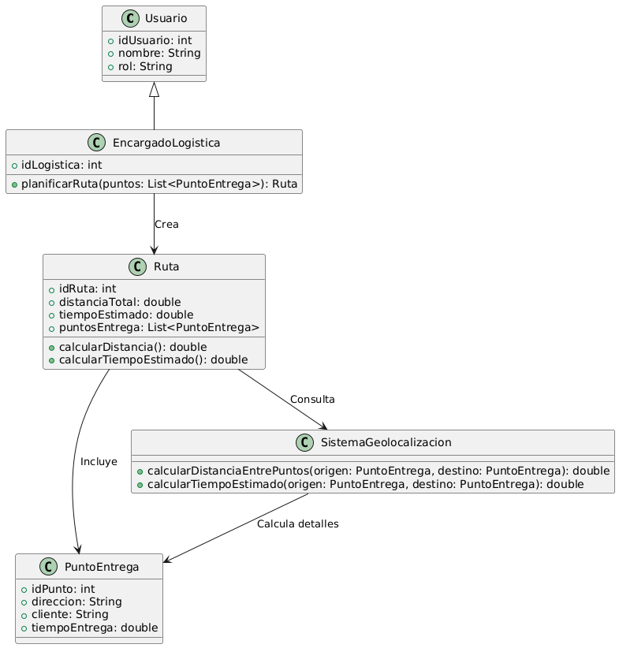

# GESTIÓN LOGISTICA

------

## Caso de uso historia 
Andrés, encargado de logística, recibe una lista de pedidos pendientes de entrega. Utiliza el sistema de gestión logística para planificar una ruta eficiente, ingresando los puntos de entrega y calculando los tiempos estimados para cada parada. El sistema genera una ruta optimizada, considerando la ubicación de los clientes y el tráfico esperado. Con esta información, Andrés asigna el plan al transportista y asegura que los productos lleguen a tiempo.

---

  <tr class="idtext principal">
    <td>ID SYN-46</td>
  </tr>
  <tr class="single text">
    <td><strong>Requerimiento</strong>:Planificar rutas con puntos de entrega y tiempos estimados. ID SYN-46</td>
  </tr>
  <tr class="single gray">
    <td><strong>Historia de usuario</strong></td>
  </tr>
  <tr class="single text">
    <td>Como encargado de logística quiero planificar rutas con puntos de entrega y tiempos estimados para optimizar el proceso de distribución y asegurar que los productos lleguen a tiempo a los clientes.
</td>
  </tr>
  <tr class="duo">
    <th class="gray"><strong>Estado de la tarea</strong></th>
    <th>En desarrollo</th>
  </tr>
  <tr class="single gray">
    <td><strong>Caso de uso (Pasos)</strong></td>
  </tr>
  <tr class="single text">
    <td>
        <ol>
            <li>
             <li>El encargado de logística inicia sesión en el sistema de gestión de rutas.</li>
            <li>El encargado selecciona la opción para planificar una nueva ruta de distribución.</li>
            <li>El sistema muestra un formulario para ingresar los puntos de entrega, donde el encargado debe seleccionar las ubicaciones de los clientes y asociarles tiempos estimados de entrega.</li>
            <li>El encargado ingresa o selecciona los puntos de entrega (direcciones de clientes) y asigna tiempos estimados de llegada.</li>
            <li>El encargado revisa la ruta sugerida, pudiendo ajustar manualmente el orden de los puntos de entrega si es necesario.</li>
            <li>El encargado guarda y asigna la ruta a un vehículo o equipo de distribución.</li>
            <li>El sistema confirma la planificación de la ruta, proporcionando detalles de la misma.</li>
          </ol>
   </td>
  </tr>
  <tr class="single gray">
    <td><strong>Criterios de aceptación</strong></td>
  </tr>
  <tr class="single text">
    <td>
        <ol>
              <li>El sistema debe permitir al encargado ingresar puntos de entrega con direcciones y tiempos estimados.<li>
              <li>El sistema debe sugerir automáticamente una ruta óptima en función de la distancia y los tiempos estimados de entrega.<li>
              <li>El encargado debe poder modificar manualmente el orden de los puntos de entrega antes de confirmar la ruta.<li>
              <li>El sistema debe mostrar un tiempo estimado total para completar la ruta, y tiempos específicos para cada punto de entrega.<li>
              <li>El encargado debe poder asignar la ruta a un vehículo o equipo de distribución.<li>
              <li>El sistema debe confirmar la planificación de la ruta y proporcionar un resumen de los detalles.<li>
              <li>Si existen errores en las direcciones o información incompleta, el sistema debe alertar al encargado.<li>
            </ol>
 <tr class="duo">
    <th class="gray"><strong>Calidad</strong></th>
    <th>En desarrollo</th>
  </tr>
  <tr class="duo">
    <th class="gray"><strong>Versionamiento</strong></th>
    <th>En desarrollo</th>
  </tr>
</table>

---
## Diagrama de Caso de uso
[Creado con plantuml](https://plantuml.com/es/)

---