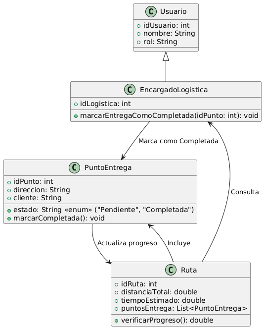

# GESTIÓN LOGISTICA

------

## Caso de uso historia 
Andrés, encargado de logística, revisa el estado de las entregas del día en el sistema. A medida que los transportistas confirman las entregas realizadas, Andrés marca cada pedido como "Completado". El sistema actualiza automáticamente el registro de entregas, permitiendo a Andrés llevar un control preciso del progreso y generar reportes cuando sea necesario.

---

  <tr class="idtext principal">
    <td>ID SYN-47</td>
  </tr>
  <tr class="single text">
    <td><strong>Requerimiento</strong>:Marcar entregas como completadas. ID SYN-47</td>
  </tr>
  <tr class="single gray">
    <td><strong>Historia de usuario</strong></td>
  </tr>
  <tr class="single text">
    <td>Como encargado de logística quiero marcar entregas como completadas para mantener un registro preciso de las entregas realizadas y facilitar el seguimiento del progreso.
</td>
  </tr>
  <tr class="duo">
    <th class="gray"><strong>Estado de la tarea</strong></th>
    <th>En desarrollo</th>
  </tr>
  <tr class="single gray">
    <td><strong>Caso de uso (Pasos)</strong></td>
  </tr>
  <tr class="single text">
    <td>
        <ol>
            <li>
             <li>El encargado de logística inicia sesión en el sistema de gestión de entregas.</li>
              <li>El encargado accede a la lista de entregas programadas o pendientes.</li>
              <li>El encargado selecciona una entrega que ha sido realizada y debe marcarla como completada.</li>
              <li>El sistema muestra los detalles de la entrega seleccionada (cliente, dirección, fecha y hora de entrega).</li>
              <li>El encargado confirma que la entrega ha sido realizada correctamente y marca la entrega como completada.</li>
              <li>El sistema actualiza el estado de la entrega a "Completada" y la elimina de la lista de entregas pendientes.</li>
              <li>El encargado recibe una notificación de confirmación de que la entrega ha sido marcada como completada.</li>
          </ol>
   </td>
  </tr>
  <tr class="single gray">
    <td><strong>Criterios de aceptación</strong></td>
  </tr>
  <tr class="single text">
    <td>
        <ol>
              <li>El sistema debe permitir al encargado marcar entregas como completadas.</li>
              <li>El encargado debe poder ver los detalles de la entrega antes de marcarla como completada.</li>
              <li>El sistema debe actualizar automáticamente el estado de la entrega a "Completada" una vez marcada.</li>
              <li>La entrega debe desaparecer de la lista de entregas pendientes y aparecer en una lista de entregas completadas.</li>
              <li>El encargado debe recibir una notificación de confirmación una vez que la entrega ha sido completada.</li>
              <li>Si la entrega tiene información faltante, el sistema debe mostrar un mensaje de error indicando que no se puede marcar como completada.</li>
            </ol>
 <tr class="duo">
    <th class="gray"><strong>Calidad</strong></th>
    <th>En desarrollo</th>
  </tr>
  <tr class="duo">
    <th class="gray"><strong>Versionamiento</strong></th>
    <th>En desarrollo</th>
  </tr>
</table>

---
## Diagrama de Caso de uso
[Creado con plantuml](https://plantuml.com/es/)

---