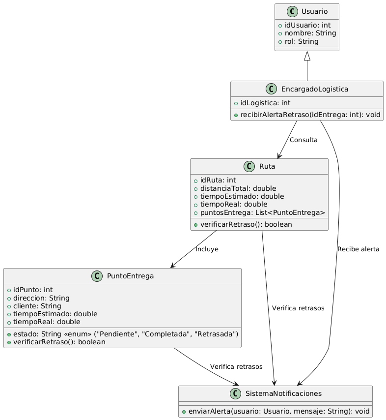

# GESTIÓN LOGISTICA

------

## Caso de uso historia 
Andrés, encargado de logística, recibe una alerta del sistema indicando un retraso en una entrega debido a tráfico inesperado. Con esta información, contacta al transportista para evaluar la situación y actualiza al cliente sobre el nuevo tiempo estimado de llegada. Gracias a la alerta temprana, Andrés puede tomar acciones correctivas y minimizar el impacto del retraso en la experiencia del cliente.

---

  <tr class="idtext principal">
    <td>ID SYN-48</td>
  </tr>
  <tr class="single text">
    <td><strong>Requerimiento</strong>:Enviar alertas sobre retrasos en entregas. ID SYN-48</td>
  </tr>
  <tr class="single gray">
    <td><strong>Historia de usuario</strong></td>
  </tr>
  <tr class="single text">
    <td>Como encargado de logística quiero marcar entregas como completadas para mantener un registro preciso de las entregas realizadas y facilitar el seguimiento del progreso.
</td>
  </tr>
  <tr class="duo">
    <th class="gray"><strong>Estado de la tarea</strong></th>
    <th>En desarrollo</th>
  </tr>
  <tr class="single gray">
    <td><strong>Caso de uso (Pasos)</strong></td>
  </tr>
  <tr class="single text">
    <td>
        <ol>
            <li>
             <li>El sistema verifica la hora y fecha de entrega estimada de todas las entregas programadas.</li>
            <li>El sistema detecta que una entrega está retrasada en relación con el tiempo estimado.</li>
            <li>El sistema genera una alerta y la envía al encargado de logística informando del retraso.</li>
            <li>El encargado recibe la alerta con los detalles de la entrega retrasada: cliente, dirección, hora estimada de llegada y la nueva hora estimada de entrega.</li>
            <li>El encargado de logística toma acciones correctivas, como contactar al cliente o reasignar recursos para solucionar el retraso.</li>
            <li>El sistema actualiza el estado de la entrega como "Retrasada" y mantiene a los usuarios informados.</li>
          </ol>
   </td>
  </tr>
  <tr class="single gray">
    <td><strong>Criterios de aceptación</strong></td>
  </tr>
  <tr class="single text">
    <td>
        <ol>
              <li>El sistema debe generar alertas automáticas cuando se detecte un retraso en una entrega programada.</li>
              <li>Las alertas deben incluir la siguiente información: Nombre del cliente, Dirección de entrega, Hora estimada de llegada, Hora nueva estimada de entrega.</li>
              <li>El encargado de logística debe recibir la alerta en tiempo real (por correo electrónico, mensaje en la plataforma, etc.).</li>
              <li>El sistema debe registrar el retraso en el historial de entregas.</li>
              <li>El sistema debe permitir al encargado tomar acciones para mitigar el retraso.</li>
 <tr class="duo">
    <th class="gray"><strong>Calidad</strong></th>
    <th>En desarrollo</th>
  </tr>
  <tr class="duo">
    <th class="gray"><strong>Versionamiento</strong></th>
    <th>En desarrollo</th>
  </tr>
</table>

---
## Diagrama de Caso de uso
[Creado con plantuml](https://plantuml.com/es/)

---
 