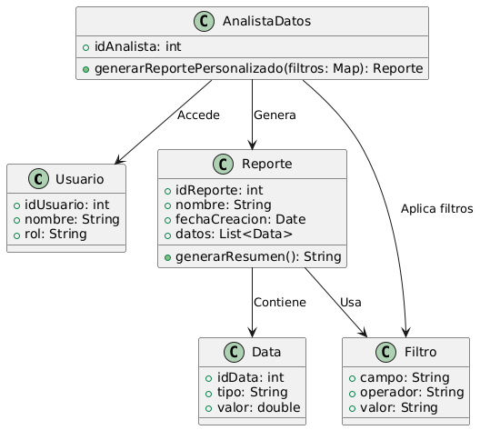

# GESTIÓN ANALISIS Y REPORTES 

------

## Caso de uso historia 
María, analista de datos, necesita evaluar el desempeño de las ventas en regiones específicas. Accede al sistema de reportes y selecciona los datos que desea combinar: ventas por región, productos más vendidos y márgenes de ganancia. El sistema genera un reporte personalizado que María exporta para presentar en una reunión. Con esta información detallada, puede identificar patrones y recomendar estrategias basadas en datos concretos.

---

  <tr class="idtext principal">
    <td>ID SYN-49</td>
  </tr>
  <tr class="single text">
    <td><strong>Requerimiento</strong>:Generar reportes personalizados combinando datos del sistema. ID SYN-49</td>
  </tr>
  <tr class="single gray">
    <td><strong>Historia de usuario</strong></td>
  </tr>
  <tr class="single text">
    <td>Como analista de datos quiero generar reportes personalizados combinando datos del sistema para obtener ideas específicas que me ayuden a tomar decisiones informadas y a realizar un análisis detallado.
</td>
  </tr>
  <tr class="duo">
    <th class="gray"><strong>Estado de la tarea</strong></th>
    <th>En desarrollo</th>
  </tr>
  <tr class="single gray">
    <td><strong>Caso de uso (Pasos)</strong></td>
  </tr>
  <tr class="single text">
    <td>
        <ol>
            <li>
             <li>El usuario inicia sesión en el sistema y accede a la sección de reportes.</li>
            <li>El sistema muestra una interfaz para crear un reporte personalizado, con opciones de filtro (por ejemplo, por fecha, producto, cliente, etc.).</li>
            <li>El usuario selecciona los parámetros de los datos que desea combinar en el reporte.</li>
            <li>El usuario elige las métricas o indicadores clave que quiere incluir (por ejemplo, ventas totales, cantidad de productos vendidos, etc.).</li>
            <li>El sistema combina los datos seleccionados de manera dinámica y genera el reporte en el formato solicitado (PDF, Excel, etc.).</li>
            <li>El usuario visualiza el reporte generado y tiene la opción de descargarlo o compartirlo.</li>
          </ol>
   </td>
  </tr>
  <tr class="single gray">
    <td><strong>Criterios de aceptación</strong></td>
  </tr>
  <tr class="single text">
    <td>
        <ol>
              <li>El sistema debe permitir al usuario seleccionar múltiples fuentes de datos (por ejemplo, ventas, inventarios, clientes) para crear un reporte personalizado.</li>
              <li>El reporte generado debe reflejar únicamente los datos solicitados y debe ser preciso.</li>
              <li>El sistema debe permitir elegir filtros como: fechas, productos, clientes, etc.</li>
              <li>El usuario debe poder seleccionar el formato de salida del reporte (PDF, Excel, etc.).</li>
              <li>El sistema debe mostrar un mensaje claro si no hay datos disponibles para los filtros seleccionados.</li>
              <li>El reporte generado debe ser accesible para su descarga o envío por correo electrónico.</li>
 <tr class="duo">
    <th class="gray"><strong>Calidad</strong></th>
    <th>En desarrollo</th>
  </tr>
  <tr class="duo">
    <th class="gray"><strong>Versionamiento</strong></th>
    <th>En desarrollo</th>
  </tr>
</table>

---
## Diagrama de Caso de uso
[Creado con plantuml](https://plantuml.com/es/)

---
 