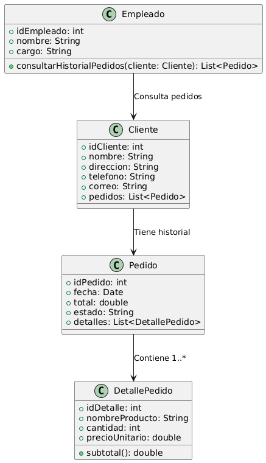

# GESTIÓN DE VENTAS

------

## Caso de uso historia 
Juan, empleado de ventas, consulta el historial de pedidos de Pedro Martínez en el sistema para obtener detalles sobre sus compras anteriores. Con esta información, puede ofrecer un mejor servicio y hacer recomendaciones personalizadas para su nuevo pedido.

---

<table id="customers">
  <tr class="idtext principal">
    <td>ID SYN-5</td>
  </tr>
  <tr class="single text">
    <td><strong>Requerimiento</strong>: Consultar el historial de pedidos realizados. ID SYN-5</td>
  </tr>
  <tr class="single gray">
    <td><strong>Historia de usuario</strong></td>
  </tr>
  <tr class="single text">
    <td>Como empleado del área de ventas quiero poder consultar el historial de pedidos realizados por un cliente para obtener información sobre sus compras anteriores y brindar un mejor servicio al cliente.</td>
  </tr>
  <tr class="duo">
    <th class="gray"><strong>Estado de la tarea</strong></th>
    <th>En desarrollo</th>
  </tr>
  <tr class="single gray">
    <td><strong>Caso de uso (Pasos)</strong></td>
  </tr>
  <tr class="single text">
    <td>
        <ol>
            <li>El empleado ingresa el identificador del cliente (nombre, ID, teléfono, etc.).</li>
            <li>El sistema muestra una lista de pedidos del cliente, ordenada por fecha (más reciente primero).</li>
            <li>El empleado puede seleccionar un pedido para ver más detalles: productos, monto total, fecha de entrega estimada y estado del pedido.</li>
            <li>El empleado finaliza la consulta o puede buscar otro pedido.</li>
    </td>
  </tr>
  <tr class="single gray">
    <td><strong>Criterios de Aceptación</strong></td>
  </tr>
  <tr class="single text">
    <td>
        <ol>
            <li>El sistema debe permitir la consulta de pedidos por identificador del cliente.</li>
            <li>Los pedidos deben estar ordenados por fecha, de más reciente a más antiguo.</li>
            <li>El sistema debe mostrar detalles básicos de cada pedido (número de pedido, estado, fecha de entrega, monto total).</li>
            <li>El empleado debe poder ver detalles completos del pedido seleccionado (productos, cliente, pago, estado, etc.).</li>
        </ol>
    </td>
  </tr>
 <tr class="duo">
    <th class="gray"><strong>Calidad</strong></th>
    <th>En desarrollo</th>
  </tr>
  <tr class="duo">
    <th class="gray"><strong>Versionamiento</strong></th>
    <th>En desarrollo</th>
  </tr>
</table>

---
## Diagrama de Caso de uso
[Creado con plantuml](https://plantuml.com/es/)

---
