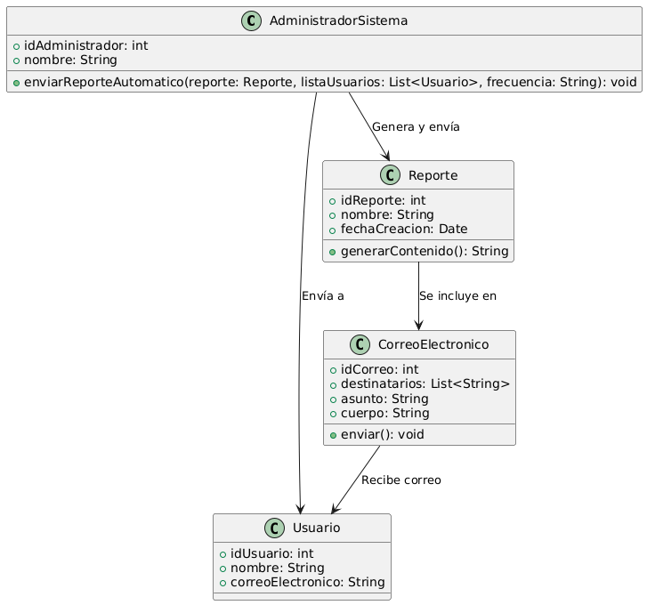

# GESTIÓN ANALISIS Y REPOSTES 

------

## Caso de uso historia 
Daniel, administrador del sistema, configura el envío automático de reportes semanales de ventas para los gerentes. Define el contenido del reporte, selecciona a los destinatarios clave y programa el envío cada lunes a las 8:00 a. m. El sistema genera los reportes automáticamente y los envía por correo en el formato definido. Los gerentes reciben la información sin interrupciones, lo que les permite tomar decisiones oportunas.

---

  <tr class="idtext principal">
    <td>ID SYN-52</td>
  </tr>
  <tr class="single text">
    <td><strong>Requerimiento</strong>:Enviar reportes automáticos por correo a usuarios clave. ID SYN-52</td>
  </tr>
  <tr class="single gray">
    <td><strong>Historia de usuario</strong></td>
  </tr>
  <tr class="single text">
    <td>Como administrador del sistema quiero enviar reportes automáticos por correo a usuarios clave para asegurar que reciban la información relevante de manera oportuna y sin necesidad de generar el reporte manualmente.
</td>
  </tr>
  <tr class="duo">
    <th class="gray"><strong>Estado de la tarea</strong></th>
    <th>En desarrollo</th>
  </tr>
  <tr class="single gray">
    <td><strong>Caso de uso (Pasos)</strong></td>
  </tr>
  <tr class="single text">
    <td>
        <ol>
            <li>
             <li>El administrador accede al módulo de "Reportes" en el sistema.</li>
            <li>El administrador selecciona un reporte previamente configurado para envío automático (por ejemplo, reporte de ventas mensual).</li>
            <li>El administrador elige los usuarios clave (por ejemplo, gerentes, analistas, etc.) a quienes se enviará el reporte automáticamente.</li>
            <li>El administrador configura la frecuencia del reporte automático (diario, semanal, mensual, etc.).</li>
            <li>El sistema verifica la configuración de los usuarios y las direcciones de correo electrónico.</li>
            <li>El sistema genera el reporte según la programación establecida y lo envía automáticamente a los usuarios clave a través del correo electrónico.</li>
            <li>Los usuarios reciben el reporte en su bandeja de entrada sin intervención manual.</li>
          </ol>
   </td>
  </tr>
  <tr class="single gray">
    <td><strong>Criterios de aceptación</strong></td>
  </tr>
  <tr class="single text">
    <td>
        <ol>
              <li>Configuración de Reportes Automáticos: El sistema debe permitir configurar reportes automáticos para que se envíen en intervalos regulares (diarios, semanales, mensuales).</li>
              <li>Selección de Destinatarios: El administrador debe poder seleccionar los usuarios clave a los que se enviarán los reportes automáticamente.</li>
              <li>Verificación de Correo: El sistema debe validar que las direcciones de correo electrónico de los destinatarios sean correctas antes de realizar el envío.</li>
              <li>Generación y Envío de Reportes: El sistema debe generar el reporte correctamente y enviarlo a los destinatarios sin intervención manual.</li>
              <li>Notificación de Error: Si hay un error al generar o enviar el reporte, el sistema debe notificar al administrador con detalles sobre el fallo.</li>
            </ol>
 <tr class="duo">
    <th class="gray"><strong>Calidad</strong></th>
    <th>En desarrollo</th>
  </tr>
  <tr class="duo">
    <th class="gray"><strong>Versionamiento</strong></th>
    <th>En desarrollo</th>
  </tr>
</table>

---
## Diagrama de Caso de uso
[Creado con plantuml](https://plantuml.com/es/)

---
 