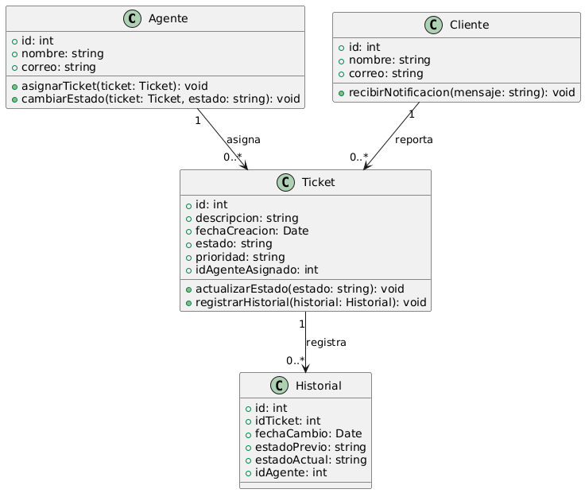

# GESTIÓN SOPORTE Y COMUNICACIÓN

------

## Caso de uso historia 
Mario, agente de soporte, revisa los tickets pendientes y asigna uno a un compañero especializado en el problema descrito. A medida que el trabajo avanza, actualiza el estado del ticket de "Pendiente" a "En progreso" y, al solucionarlo, lo marca como "Resuelto". Esto asegura un seguimiento claro de cada solicitud y mejora la eficiencia en la gestión del soporte.

---

  <tr class="idtext principal">
    <td>ID SYN-54</td>
  </tr>
  <tr class="single text">
    <td><strong>Requerimiento</strong>:Crear tickets de soporte con descripción y prioridad. ID SYN-54</td>
  </tr>
  <tr class="single gray">
    <td><strong>Historia de usuario</strong></td>
  </tr>
  <tr class="single text">
    <td>Como agente de soporte quiero asignar y cambiar el estado de los tickets de soporte para gestionar eficientemente las solicitudes y mantener actualizado su progreso.

</td>
  </tr>
  <tr class="duo">
    <th class="gray"><strong>Estado de la tarea</strong></th>
    <th>En desarrollo</th>
  </tr>
  <tr class="single gray">
    <td><strong>Caso de uso (Pasos)</strong></td>
  </tr>
  <tr class="single text">
    <td>
        <ol>
            <li>El agente accede al módulo de gestión de tickets.</li>
            <li>Selecciona un ticket específico de la lista.</li>
            <li>Asigna el ticket a sí mismo o a otro agente/equipo según las necesidades.</li>
            <li>Cambia el estado del ticket (por ejemplo, "En proceso", "Resuelto", "Escalado", etc.).</li>
            <li>Guarda los cambios.</li>
            <li>El sistema actualiza la información del ticket y notifica al agente o usuario correspondiente.</li>
          </ol>
   </td>
  </tr>
  <tr class="single gray">
    <td><strong>Criterios de aceptación</strong></td>
  </tr>
  <tr class="single text">
    <td>
        <ol>
              <li>Asignación de Tickets: El sistema debe permitir asignar o reasignar tickets a agentes o equipos específicos.</li>
              <li>Cambio de Estado: El sistema debe permitir cambiar estados predefinidos como "Pendiente", "En proceso", "Escalado", "Resuelto" o "Cerrado".</li>
              <li>Validación del Flujo de Trabajo: El sistema debe restringir cambios de estado incompatibles, como cerrar un ticket sin haberlo resuelto.</li>
              <li>Notificaciones: Los cambios de estado deben generar notificaciones automáticas al usuario final y al agente responsable.</li>
            </ol>
 <tr class="duo">
    <th class="gray"><strong>Calidad</strong></th>
    <th>En desarrollo</th>
  </tr>
  <tr class="duo">
    <th class="gray"><strong>Versionamiento</strong></th>
    <th>En desarrollo</th>
  </tr>
</table>

---
## Diagrama de Caso de uso
[Creado con plantuml](https://plantuml.com/es/)

---
 