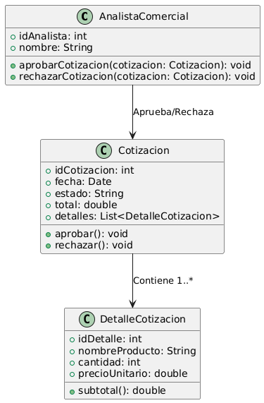

# GESTIÓN DE VENTAS

------

## Caso de uso historia 
El analista comercial, al recibir las cotizaciones generadas por el equipo de ventas, revisa los detalles de cada una para asegurarse de que sean correctas y cumplan con las políticas de la empresa.Accede al sistema de gestión de cotizaciones y consulta las propuestas pendientes de aprobación. Después de revisar cada cotización, el analista tiene la opción de aprobar aquellas que son válidas y rechazar las que no lo son, ya sea por errores en los productos, precios o condiciones.

---

<table id="customers">
  <tr class="idtext principal">
    <td>ID SYN-6</td>
  </tr>
  <tr class="single text">
    <td><strong>Requerimiento</strong>: Aprobar o rechazar cotizaciones. ID SYN-6</td>
  </tr>
  <tr class="single gray">
    <td><strong>Historia de usuario</strong></td>
  </tr>
  <tr class="single text">
    <td>Como analista comercial quiero aprobar o rechazar cotizaciones para gestionar las cotizaciones de manera eficiente y asegurar que solo las válidas sean procesadas.</td>
  </tr>
  <tr class="duo">
    <th class="gray"><strong>Estado de la tarea</strong></th>
    <th>En desarrollo</th>
  </tr>
  <tr class="single gray">
    <td><strong>Caso de uso (Pasos)</strong></td>
  </tr>
  <tr class="single text">
    <td>
        <ol>
            <li>El analista comercial accede a la cotización pendiente a través del sistema.</li>
            <li>El analista revisa los detalles de la cotización (productos, precios, cliente).</li>
            <li>El analista decide aprobar o rechazar la cotización.</li>
            <li>El sistema actualiza el estado de la cotización en el sistema.</li>
    </td>
  </tr>
  <tr class="single gray">
    <td><strong>Criterios de Aceptación</strong></td>
  </tr>
  <tr class="single text">
    <td>
        <ol>
            <li>El analista comercial debe poder aprobar o rechazar una cotización con un solo clic.</li>
            <li>Al aprobar la cotización, el estado debe cambiar a "Aprobada" y notificar al asistente administrativo.</li>
            <li>Al rechazar la cotización, el estado debe cambiar a "Rechazada" y notificar al asistente administrativo.</li>
            <li>El sistema debe reflejar los cambios de estado en tiempo real.</li>
        </ol>
    </td>
  </tr>
 <tr class="duo">
    <th class="gray"><strong>Calidad</strong></th>
    <th>En desarrollo</th>
  </tr>
  <tr class="duo">
    <th class="gray"><strong>Versionamiento</strong></th>
    <th>En desarrollo</th>
  </tr>
</table>

---
## Diagrama de Caso de uso
[Creado con plantuml](https://plantuml.com/es/)

---
