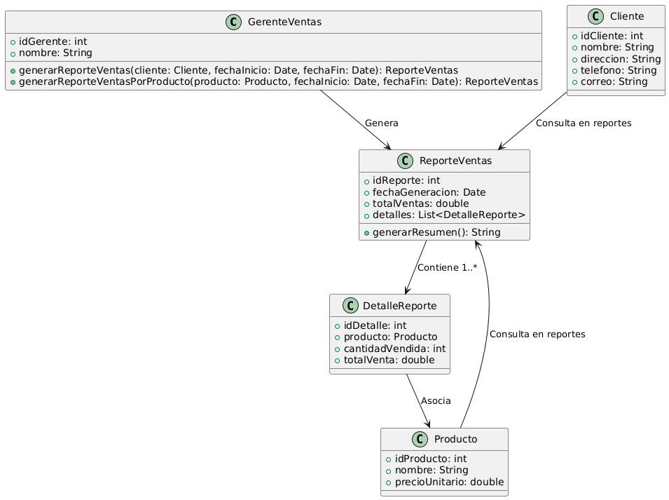

# GESTIÓN DE VENTAS

------

## Caso de uso historia 
Jorge, gerente de ventas, genera un reporte de ventas filtrado por cliente, producto o fechas para analizar el desempeño. El sistema le muestra los datos relevantes, como cantidades y ingresos, permitiéndole tomar decisiones informadas sobre futuras estrategias de ventas.

---

<table id="customers">
  <tr class="idtext principal">
    <td>ID SYN-7</td>
  </tr>
  <tr class="single text">
    <td><strong>Requerimiento</strong>: Generar reportes de ventas por cliente. ID SYN-7</td>
  </tr>
  <tr class="single gray">
    <td><strong>Historia de usuario</strong></td>
  </tr>
  <tr class="single text">
    <td>Como gerente de ventas quiero generar reportes de ventas por cliente, producto o fechas para analizar el desempeño de las ventas y tomar decisiones.</td>
  </tr>
  <tr class="duo">
    <th class="gray"><strong>Estado de la tarea</strong></th>
    <th>En desarrollo</th>
  </tr>
  <tr class="single gray">
    <td><strong>Caso de uso (Pasos)</strong></td>
  </tr>
  <tr class="single text">
    <td>
        <ol>
            <li>El gerente accede a la sección de reportes de ventas en el sistema.</li>
            <li>El gerente selecciona los filtros de reporte (cliente, producto, fechas).</li>
            <li>El sistema muestra una vista previa de los datos filtrados.</li>
            <li>El gerente puede generar el reporte en formato PDF o Excel.</li>
            <li>El reporte es generado y puede ser descargado o enviado por correo electrónico.</li>
    </td>
  </tr>
  <tr class="single gray">
    <td><strong>Criterios de Aceptación</strong></td>
  </tr>
  <tr class="single text">
    <td>
        <ol>
            <li>El sistema debe permitir filtrar las ventas por cliente, producto o fechas.</li>
            <li>El reporte debe incluir todos los detalles relevantes: producto, cantidad, precio, fecha de venta, y cliente.</li>
            <li>El sistema debe permitir la generación de reportes en formato PDF y Excel.</li>
            <li>El reporte generado debe ser preciso y reflejar la información filtrada.</li>
        </ol>
    </td>
  </tr>
 <tr class="duo">
    <th class="gray"><strong>Calidad</strong></th>
    <th>En desarrollo</th>
  </tr>
  <tr class="duo">
    <th class="gray"><strong>Versionamiento</strong></th>
    <th>En desarrollo</th>
  </tr>
</table>

---
## Diagrama de Caso de uso
[Creado con plantuml](https://plantuml.com/es/)

---
