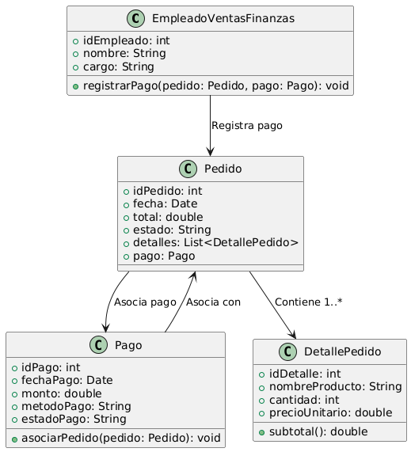

# GESTIÓN DE VENTAS

------

## Caso de uso historia 
Jorge, gerente de ventas, genera un reporte de ventas filtrado por cliente, producto o fechas para analizar el desempeño. El sistema le muestra Carlos, un empleado del área de ventas, recibe la notificación de que Pedro Martínez ha realizado el pago de su pedido. Para asegurar que la transacción se registre correctamente, Carlos accede al sistema de gestión de pedidos y selecciona el pedido de Pedro.

---

<table id="customers">
  <tr class="idtext principal">
    <td>ID SYN-8</td>
  </tr>
  <tr class="single text">
    <td><strong>Requerimiento</strong>: Registrar el pago asociado a un pedido. ID SYN-8</td>
  </tr>
  <tr class="single gray">
    <td><strong>Historia de usuario</strong></td>
  </tr>
  <tr class="single text">
    <td>Como empleado del área de ventas o finanzas quiero registrar el pago asociado a un pedido para mantener un registro preciso de las transacciones y asegurar que el pedido sea procesado correctamente.</td>
  </tr>
  <tr class="duo">
    <th class="gray"><strong>Estado de la tarea</strong></th>
    <th>En desarrollo</th>
  </tr>
  <tr class="single gray">
    <td><strong>Caso de uso (Pasos)</strong></td>
  </tr>
  <tr class="single text">
    <td>
        <ol>
            <li>El empleado accede al sistema y busca el pedido para el cual se va a registrar el pago.</li>
            <li>El empleado selecciona el pedido y hace clic en "Registrar Pago".</li>
            <li>l sistema solicita los detalles del pago (monto, método de pago, fecha de pago).</li>
            <li>El empleado ingresa los datos del pago.</li>
            <li>El sistema verifica que el monto del pago sea correcto y lo asocia al pedido.</li>
            <li>El sistema actualiza el estado del pedido a "Pago Recibido" o "Pago Pendiente" según corresponda.</li>
            <li>El sistema genera un recibo de pago que puede ser enviado al cliente o almacenado en el sistema.</li>
    </td>
  </tr>
  <tr class="single gray">
    <td><strong>Criterios de Aceptación</strong></td>
  </tr>
  <tr class="single text">
    <td>
        <ol>
            <li>El sistema debe permitir registrar el pago mediante los detalles como monto, método de pago y fecha.</li>
            <li>El sistema debe verificar que el monto del pago sea igual o mayor al monto pendiente del pedido.</li>
            <li>El sistema debe actualizar automáticamente el estado del pedido a "Pago Recibido" si el pago es completo.</li>
            <li>El sistema debe generar un recibo de pago que se puede descargar o enviar al cliente.</li>
        </ol>
    </td>
  </tr>
 <tr class="duo">
    <th class="gray"><strong>Calidad</strong></th>
    <th>En desarrollo</th>
  </tr>
  <tr class="duo">
    <th class="gray"><strong>Versionamiento</strong></th>
    <th>En desarrollo</th>
  </tr>
</table>

---
## Diagrama de Caso de uso
[Creado con plantuml](https://plantuml.com/es/)

---
