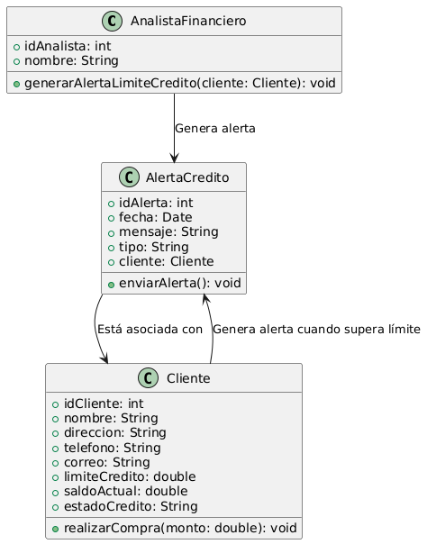

# GESTIÓN DE INVENTARIO

------

## Caso de uso historia 
Ana, encargada de inventarios, recibe una nueva entrega de productos para el inventario. Para asegurarse de que todos los productos estén correctamente registrados, accede al sistema de gestión de inventarios.En el sistema, Ana selecciona la opción "Registrar Producto Nuevo" y completa los detalles requeridos, como nombre, categoría, cantidad, precio, y proveedor. Al guardar la información, el sistema actualiza el inventario y asegura que el producto esté disponible para su venta o distribución.

---

<table id="customers">
  <tr class="idtext principal">
    <td>ID SYN-9</td>
  </tr>
  <tr class="single text">
    <td><strong>Requerimiento</strong>: Registrar nuevos productos. ID SYN-9</td>
  </tr>
  <tr class="single gray">
    <td><strong>Historia de usuario</strong></td>
  </tr>
  <tr class="single text">
    <td>Como encargado de inventarios quiero registrar nuevos productos con detalles iniciales para asegurarme de que todos los productos estén correctamente ingresados y disponibles en el sistema.</td>
  </tr>
  <tr class="duo">
    <th class="gray"><strong>Estado de la tarea</strong></th>
    <th>En desarrollo</th>
  </tr>
  <tr class="single gray">
    <td><strong>Caso de uso (Pasos)</strong></td>
  </tr>
  <tr class="single text">
    <td>
        <ol>
            <li>El encargado de inventarios accede al sistema y selecciona la opción "Registrar Nuevo Producto".</li>
            <li>El sistema presenta un formulario para ingresar los detalles del producto.</li>
            <li>El encargado completa los campos requeridos, tales como:Nombre del producto, Descripción ,Categoría, Precio de compra, Precio de venta ,Proveedor.</li>
            <li>El encargado revisa y confirma que la información es correcta.</li>
            <li>El sistema guarda los datos ingresados y asigna un ID único al producto.</li>
            <li>El producto es agregado al inventario y disponible para su venta o consulta.</li>
    </td>
  </tr>
  <tr class="single gray">
    <td><strong>Criterios de Aceptación</strong></td>
  </tr>
  <tr class="single text">
    <td>
        <ol>
            <li>El sistema debe permitir ingresar todos los detalles del producto mencionados en el formulario (nombre, código, descripción, categoría, precio, cantidad, proveedor).</li>
            <li>El sistema debe validar que los campos obligatorios (nombre, código, precio, cantidad) estén completos antes de permitir el registro.</li>
            <li>El sistema debe generar un ID único para cada nuevo producto registrado.</li>
            <li>El sistema debe guardar correctamente los detalles del producto y actualizar el inventario.</li>
            <li>El producto debe ser visible y accesible en el inventario una vez registrado.</li>
        </ol>
    </td>
  </tr>
 <tr class="duo">
    <th class="gray"><strong>Calidad</strong></th>
    <th>En desarrollo</th>
  </tr>
  <tr class="duo">
    <th class="gray"><strong>Versionamiento</strong></th>
    <th>En desarrollo</th>
  </tr>
</table>

---
## Diagrama de Caso de uso
[Creado con plantuml](https://plantuml.com/es/)

---
